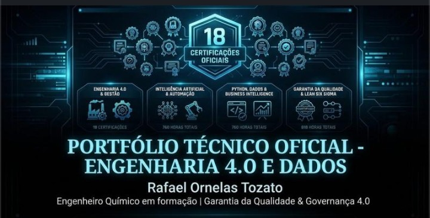

  

  
  
  
  
  

# governanca-qualidade-4.0

> **AI Engineer | Especialista em Governança 4.0 e Qualidade | Engenheiro Químico**  
> [Mauá, SP](mailto:ornelas.tozato@gmail.com) | [LinkedIn](https://www.linkedin.com/in/rafaeltozato81) | [GitHub](https://github.com/Rafael-TOZATO) | [Portfólio PWA](https://tozato-dev-hub.vercel.app) | [Medium](https://medium.com/@ornelas.tozato)

Repositório técnico e executivo focado em Governança 4.0, Qualidade Preditiva e Indústria 4.0. Contém materiais estratégicos e dashboards voltados para otimização de processos fabris, automação inteligente, integração de inteligência artificial na tomada de decisões e transformação digital corporativa avançada.
